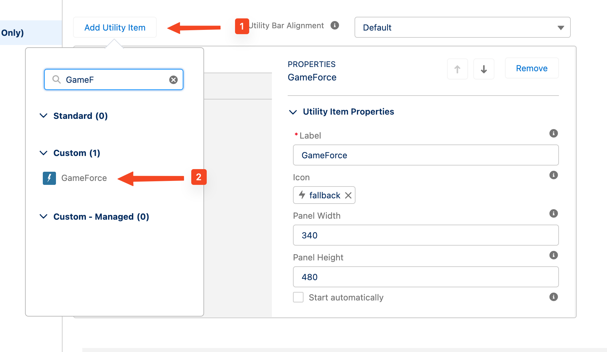
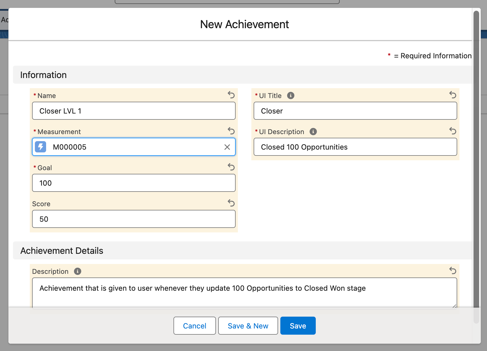
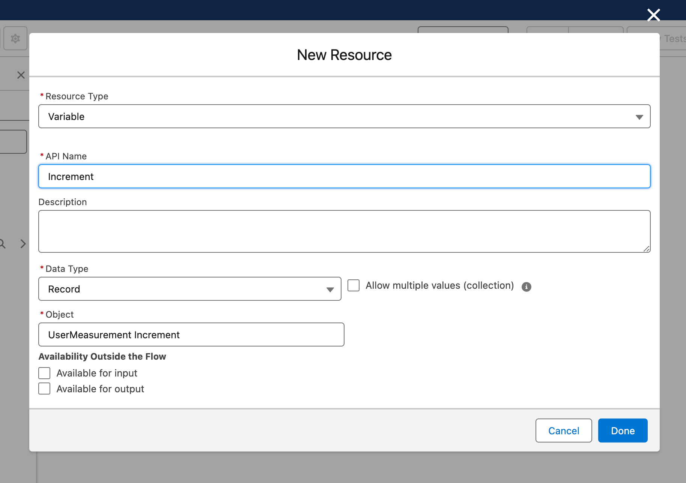
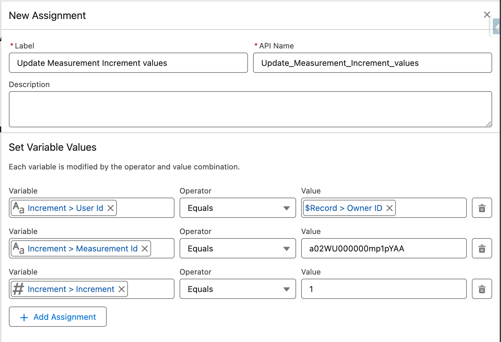

# GameForce Configuration

Once GameForce is installed from the App Exchange, there are a couple of important configuration steps that need to be taken before your Salesforce users will be able to use the app: 
1. Security configuration
2. Utility component configuration
3. (Optional) Configuring your custom achievements

## Step 1. Security configuration
GameForce comes with a wide set of Permission Sets that are combined into 2 Permission Set groups. It is not recommended to assign Permission Sets directly to users. Instead, Permission Set Groups are expected to be assigned: 
* **GameForce Admin** - For admin users and users who are expected to configure new Achievements
* **GameForce User** - For all other users that are expected to use GameForce and get Achievements

## Step 2. Utility component configuration
GameForce uses a custom utility bar component to display a notification to users when they unlock a new achievement in a system. This component is already added to the GameForce App by default, but we also recommend you to add it to other Salesforce Applications that your users are working with on a daily basis. 

1. Go to Setup, search for "App Manager" in the quick find box, and click on it
2. Select an app to which you want to add a GameForce utility component and click "Edit"

3. Click on "Utility Items (Desktop Only)"
4. Click on the "Add Utility Item" button
5. Filter by GameForce and select "GameForce" custom component

6. **IMPORTANT** Configure the newly added component to "Start automatically" set to "True". Feel free to customize the label or icon for the component

7. Repeat the steps above for each app where you expect users to be notified about achievements

## (Optional) Step 3. Configuring your own custom achievements

GameForce provides a set of standard achievements that can be used right away:

| ## | Achievement name | Description | Score |
| -- | ---------------- | ----------- | ----- |
| 01 | Sourcer | Create 10 Leads  | 10 |
| 02 | Tracker | Create 50 Leads  | 20 |
| 03 | Hunter  | Create 100 Leads | 50 |
| 04 | Ninja   | Create 200 Leads | 100 |
| 05 | Converter    | Convert 10 Leads  | 10 |
| 06 | Transformer  | Convert 50 Leads  | 20 |
| 07 | Metamorphist | Convert 100 Leads | 100 |
| 08 | Closer        | Complete 10 Tasks  | 10 |
| 09 | Taskmaster    | Complete 50 Tasks  | 20 |
| 10 | Completionist | Complete 100 Tasks | 20 |
| 11 | Executor      | Complete 200 Tasks | 100 |
| 12 | Enthusiast   | Post 10 Chatter Posts  | 10 |
| 13 | Messenger    | Post 50 Chatter Posts  | 10 |
| 14 | Collaborator | Post 100 Chatter Posts | 20 |
| 15 | Team Player  | Post 200 Chatter Posts | 50 |
| 16 | Detective  | Close 10 Cases  | 10  |
| 17 | Watson     | Close 50 Cases  | 20  |
| 18 | Sherlock   | Close 100 Cases | 100 |

But, standard achievements might not be enough to be an effective motivational tool. Luckily, GameForce supports the creation of Custom Achievements and integration with existing business processes using Platform Events.

**For example:** Let's imagine that we want to add an achievement that user unlocks whenever they update 100 Opportunities to a "Closed Won" stage

### Step 3.1. Create a custom measurement
GameForce measurements are statistics that are stored per user and are used to evaluate users' progress toward unlocking a new achievement. You can create a new measurement or utilize an existing one in case it fits your needs.

1. Login under GameForce Admin user
2. Go to: GameForce App, Measurements tab
3. Click on "New"
4. Populate Custom Identifier field (this is a unique identifier for the measurement)
5. Populate measurement description to explain the purpose of the measurement

6. Click "Save"
7. Once the newly created measurement page is opened - save its Id (we will use it later to track the progress)

### Step 3.2. Create a new Achievement
1. Login under GameForce Admin user
2. Go to: GameForce, Achievements tab
3. Click on "New"
4. Populate information for your achievement:
    - **Measurement**: is a link to the measurement that is going to be tracked to define if the achievement is unlocked for the user (created on a previous step)
    - **Goal**: the number of 'points' that the user needs to get under a specified measurement for achievement to be considered to be reached
    - **UI Title**: is an achievement title that will be displayed to the user
    - **UI Description**: is an achievement explanation that will be displayed to the user
    - **Score**: number of points that will be given to the user when he unlocks an achievement (tracked in the global Leaderboard)

5. Click "Save"

### Step 3.3. (a) Update user statistics using Flow

1. Go to Setup, search for "Flow" in the quick find box, and click on Flows
2. Create "New Flow"
3. Select "Record-Triggered Flow"
4. Select "Opportunity" as an Object

5. Set Entry Conditions to "StageName" Equals "Closed Won"

6. Create a new Flow Variable
    - API Name: Increment
    - Data Type: Record
    - Object: UserMeasurement Increment (GameForce__UserMeasurementIncrement__e)

7. Add a new Assignment block to the flow
    - Increment.User Id: Set to Opportunity Owner Id
    - Increment.Measurement Id: Set to Measurement Id saved in Step 3.1 (optionally you can retrieve an Id using a "Get Records" block and Unique Identifier of a Measurement)
    - Increment.Increment: Set to 1 (increase measurement by 1 point every time Opportunity is Closed Won)

8. Add the "Create Records" block after the assignment and set the Record to "Increment"
9. Save the flow

After your flow is activated and the user updates an achievement to the "Closed Won" stage - measurement will be updated for the user, and once it reaches the value that

### Step 3.3. (b) Update user statistics using Apex
You can utilize APEX to integrate your business logic with GameForce using GameForce__UserMeasurementIncrement__e platform event. Concrete realization depends on your requirements, but code snippet below should give you an idea on how it can be done:

```java
GameForce__UserMeasurementIncrement__e  evt = new GameForce__UserMeasurementIncrement__e();
evt.GameForce__UserId__c = 'USER ID';
evt.GameForce__MeasurementId__c = 'MEASUREMENT ID';
evt.GameForce__Increment__c = 1;

EventBus.publish(evt);
```

- **'USER ID'**: Is an Id of the user that is taking an action or making a specific change (usually an `OwnerId` from a specific record or `UserInfo.getUserId()` value)
- **'MEASUREMENT ID'**: Id of a measurement that was created in the Step 3.1. (**NOTE**: You can use Unique Identifier to search for a specific Measurement instead of relying on Id values)
- GameForce__Increment__c value: Number of 'points' that user will accumulate towards the achievement goal. GameForce bulkifies multiple events for different users while it is processing `GameForce__UserMeasurementIncrement__e` events, so you don't really have to think about bulkification on your end. 